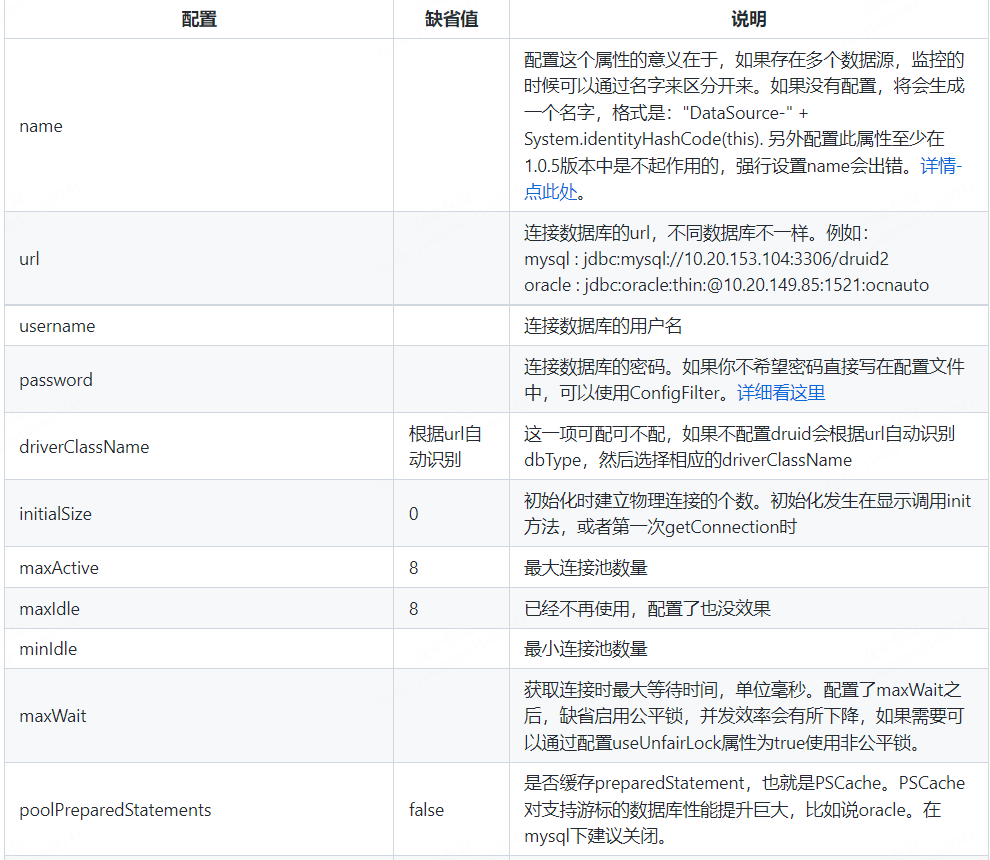
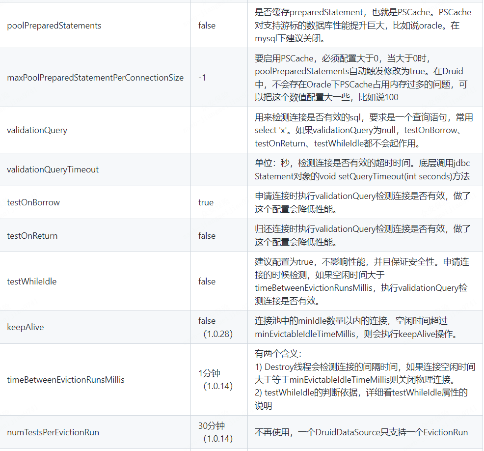
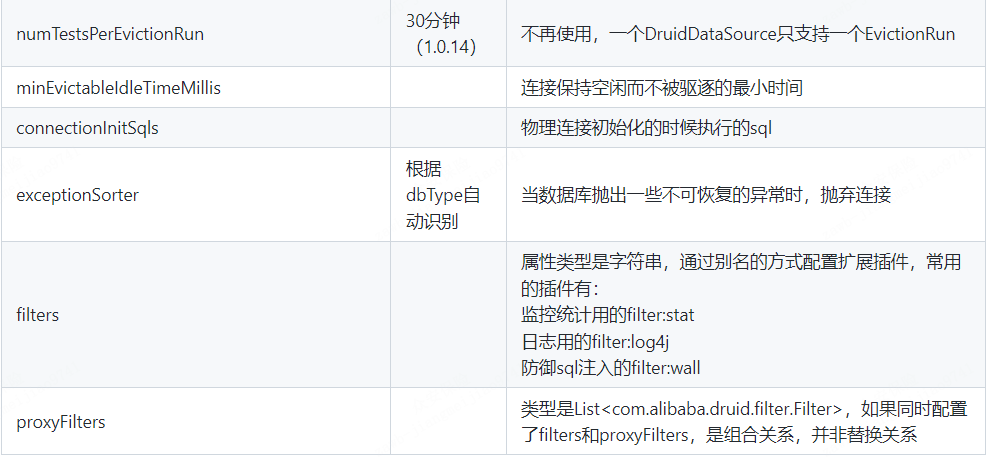

# 数据库连接池
```text
数据库连接池是一个容器，负责分配、管理数据库连接
数据库连接可重复使用，不必每次都重新创建
释放空闲时间超过最大空闲时间的数据库连接，避免因没有释放数据库而造成的数据库连接遗落

好处：
资源重用
提升系统响应速度
避免数据库连接遗落
```
# 常见数据库连接池
```text
C3P0
DBCP
Druid：德鲁伊
```
# Druid数据库连接池
```text
Druid是阿里巴巴开源平台上的一个项目，整个项目由数据库连接池、插件框架和SQL解析器组成。该项目主要是为了扩展JDBC的一些限制，
可以让程序员实现一些特殊的需求，比如向密钥服务请求凭证、统计SQL信息、SQL性能收集、SQL注入检查、SQL翻译等，程序员可以通过定制来实现自己需要的功能。
```
# 官网：https://github.com/alibaba/druid/wiki
# 配置浏览器上预览 DruidConfig
http://localhost:port/druid/index.html

# 数据库密码加密
```text
命令行输入：java -cp druid-1.1.22.jar com.alibaba.druid.filter.config.ConfigTools (数据库正确的密码)
注意：需要下载druid-1.1.22.jar包

输入：
privateKey:MIIBVQIBADANBgkqhkiG9w0BAQEFAASCAT8wggE7AgEAAkEAzENPPom3zuon5kWXbyoQV54hEN3HlijdY0ALM4KVE9qc8OxCMy2lMohKhZT9uwGm4dsGfJlu9ljDEbN9yHrJwQIDAQABAkAc/5FId5S4s1Vmw4p0JaycQ769/j5Pew2zAWyVq3wujSGbNq6GoGKgfHGg91zFdrjv17S++LktvyH8K35xyTThAiEA87umkaD3OV8R7NWH600QqgXGpYgzNxrCdYBqOvpfH7sCIQDWixx6tzkHNQBSwMDAocsryOlUOV3Zd90wa7cHcowuswIgMRsZkDWyGakB34mV/N5mARtwzmEGkI+fpjTdMkzHZYkCIQDOrUiMN0Gq3bYoAiQt7i8pSOzuBC2St9PPN5UkiYbd3QIhALzvI0hcP6ESrXkClH+7RjcBlplVzB/joBI6tdWWiafN
publicKey:MFwwDQYJKoZIhvcNAQEBBQADSwAwSAJBAMxDTz6Jt87qJ+ZFl28qEFeeIRDdx5Yo3WNACzOClRPanPDsQjMtpTKISoWU/bsBpuHbBnyZbvZYwxGzfch6ycECAwEAAQ==
password:N+Q4wEnh8P1HgYRafJPx3EFmDNOySmltWWujdyVtzPrmnNAXWg6D49ai2Tt9eRuJbqnO+AcEBmwV2aNAcj1sMg==

在配置文件中：
publicKey:MFwwDQYJKoZIhvcNAQEBBQADSwAwSAJBAMxDTz6Jt87qJ+ZFl28qEFeeIRDdx5Yo3WNACzOClRPanPDsQjMtpTKISoWU/bsBpuHbBnyZbvZYwxGzfch6ycECAwEAAQ==
password:N+Q4wEnh8P1HgYRafJPx3EFmDNOySmltWWujdyVtzPrmnNAXWg6D49ai2Tt9eRuJbqnO+AcEBmwV2aNAcj1sMg==

spring:
  datasource:
   druid:
    password: ${password}
    filters: config
    filter:
      config:
        enabled: true
    connection-properties: config.decrypt=true;config.decrypt.key=${publicKey}
```

# 配置属性列表




