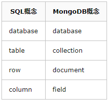

# 简介
```text
MongoDB是一个基于分布式文件存储的数据库。由C++语言编写。旨在为WEB应用提供可扩展的高性能数据存储解决方案。

MongoDB是一个介于关系数据库和非关系数据库之间的产品，是非关系数据库当中功能最丰富，最像关系数据库的。
它支持的数据结构非常松散，是类似json的bson格式，因此可以存储比较复杂的数据类型。
Mongo最大的特点是它支持的查询语言非常强大，其语法有点类似于面向对象的查询语言，几乎可以实现类似关系数据库单表查询的绝大部分功能，而且还支持对数据建立索引。
```
# 特点
```text
它的特点是高性能、易部署、易使用，存储数据非常方便。主要功能特性有：
*面向集合存储，易存储对象类型的数据。
*模式自由。
*支持动态查询。
*支持完全索引，包含内部对象。
*支持查询。
*支持复制和故障恢复。
*使用高效的二进制数据存储，包括大型对象（如视频等）。
*自动处理碎片，以支持云计算层次的扩展性。
*支持 Golang，RUBY，PYTHON，JAVA，C++，PHP，C#等多种语言。
*文件存储格式为BSON（一种JSON的扩展）。
*可通过网络访问。
```
# 基本模型

```text
database 数据库，与SQL的数据库(database)概念相同，一个数据库包含多个集合(表)
collection 集合，相当于SQL中的表(table)，一个集合可以存放多个文档(行)。 不同之处就在于集合的结构(schema)是动态的，不需要预先声明一个严格的表结构。更重要的是，默认情况下 MongoDB 并不会对写入的数据做任何schema的校验。
document 文档，相当于SQL中的行(row)，一个文档由多个字段(列)组成，并采用bson(json)格式表示。
field 字段，相当于SQL中的列(column)，相比普通column的差别在于field的类型可以更加灵活，比如支持嵌套的文档、数组。
此外，MongoDB中字段的类型是固定的、区分大小写、并且文档中的字段也是有序的。
```

```text
_id 主键，MongoDB 默认使用一个_id 字段来保证文档的唯一性。
reference 引用，勉强可以对应于 外键(foreign key) 的概念，之所以是勉强是因为 reference 并没有实现任何外键的约束，而只是由客户端(driver)自动进行关联查询、转换的一个特殊类型。
view 视图，MongoDB 3.4 开始支持视图，和 SQL 的视图没有什么差异，视图是基于表/集合之上进行动态查询的一层对象，可以是虚拟的，也可以是物理的(物化视图)。
index 索引，与SQL 的索引相同。
$lookup，这是一个聚合操作符，可以用于实现类似 SQL-join 连接的功能
transaction 事务，从 MongoDB 4.0 版本开始，提供了对于事务的支持
aggregation 聚合，MongoDB 提供了强大的聚合计算框架，group by 是其中的一类聚合操作
```
```text
{
  "_id": 1,
  "name" : { "first" : "John", "last" : "Backus" },
  "contribs" : [ "Fortran", "ALGOL", "Backus-Naur Form", "FP" ],
  "awards" : [
    {
      "award" : "W.W. McDowell Award",
      "year" : 1967,
      "by" : "IEEE Computer Society"
    }, {
      "award" : "Draper Prize",
      "year" : 1993,
      "by" : "National Academy of Engineering"
    }
  ]
}
```